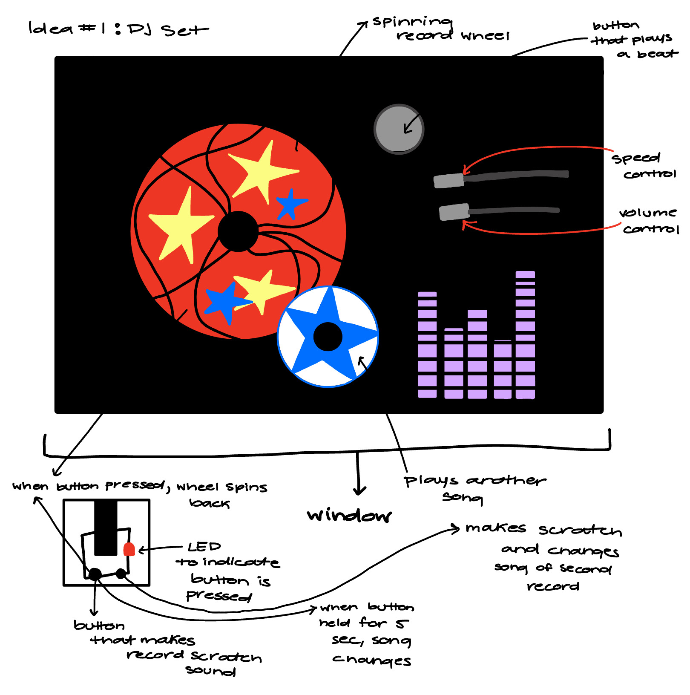
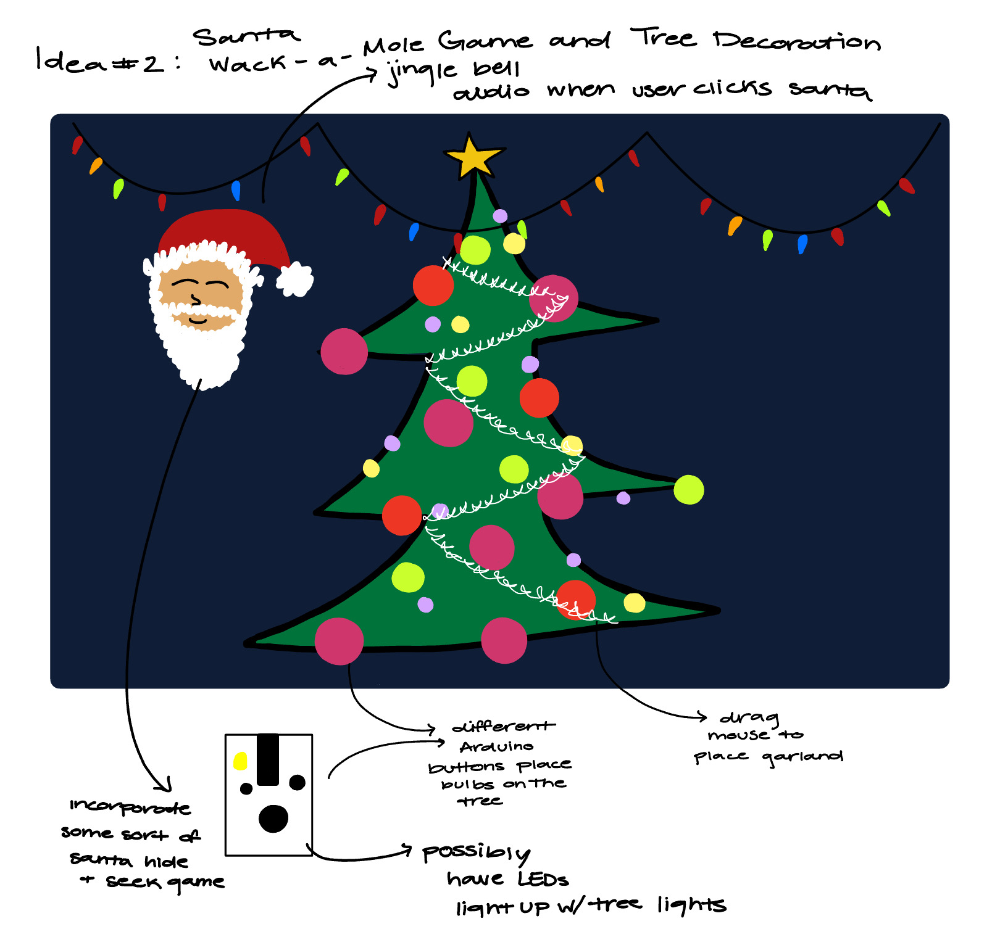
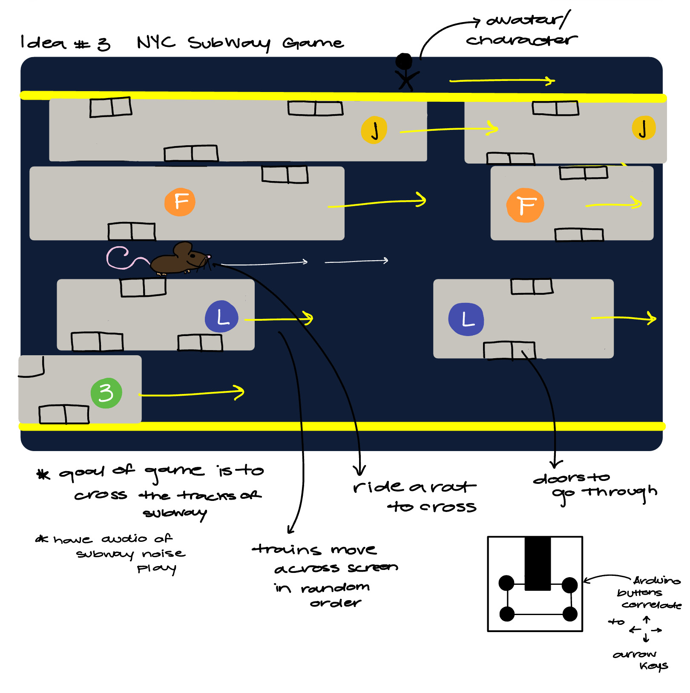
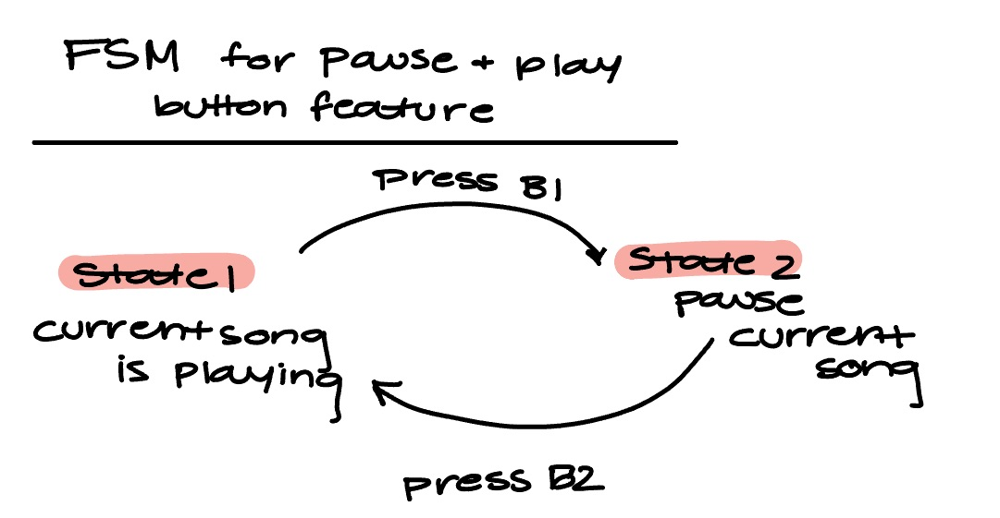
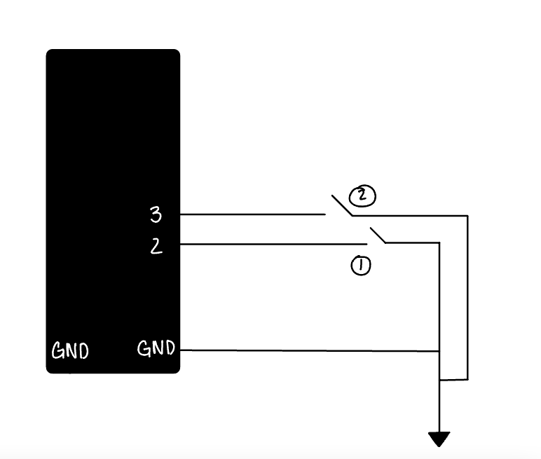
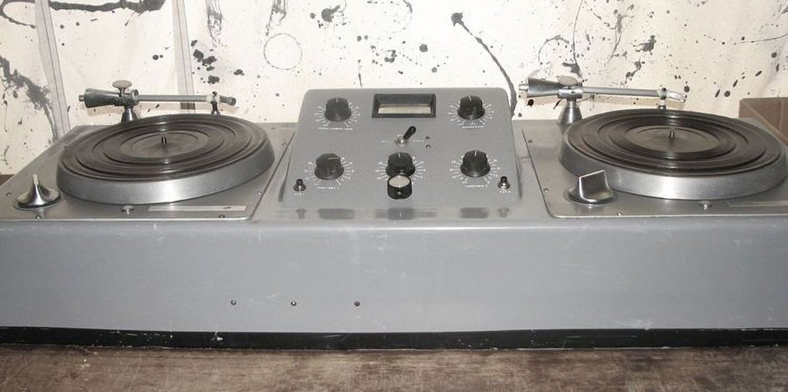

## DMGY 6063 Final Project: DJ Table Set
## By: Zaria Oliver

### Milestone 1 - Due 11/29/23

#### Idea 1: DJ Table
I thought that creating an interactive DJ table would be a great way to combine the use of the Arduino, the audio library, and what I have learned in class so far. The image below shows my idea for the table setup, with two spinning records that each can play a different song. I would like to incorporate the Arduino board by having two buttons which can record scratch songs upon being clicked, and switch songs upon being pressed for about 5 seconds. Each button coordinates to a record. When the record is scratched, the records should spin back some and the song should also rewing a bit if possible. I would also like to incorporate some other features such as volume and speed control with sliders, a button that plays an 808 beat when clicked, and a audio visualizer. 

#### Idea 2: Tree Decoration and Santa Claus Wack-a-Mole
This idea consists of two games combined. One game is decorating a Christmas tree with bulbs and garland. The garland would be applied via dragging of the mouse while the bulbs would be randomly placed with the click of a button on the Arduino. I also had an idea to possiibly have LEDs light up on the board that correspond to the lights drawn in the picture below. The Santa game would be a Santa head which pops up randomly on the screen, and the user would have to click his face to score a point.

#### Idea 3: Subway Game
This iddea is a game that challenges the palyer to cross the subway by jumping from car to car. The user can only enter and exit cars through the doors as shown in the image. The cars move across the screen and appear in random order on their tracks. When the player is on the car, their avatar will be shown moving with the train. I am not yet sure how I would like the avatar to look. There is also a feature where the user can ride a rat. I would like for the rat to also move across the screen at random points. Once the player reaches the other side of the racks, possibly a screen with a trophy or reward could popup. I would like to incorporate the Arduino by having 4 buttons that move the avatar forward, back, left, or right upon being clicked.

### Milestone 2 - Due 12/06/23

I decided to go with Idea 1 for my project as I felt like the DJ Table would allow for lots of creativity and fun features to be added. I can start simple and build on that foundation to achieve cooler features along the way. First, I wanted to focus on the Arduino board logic and getting it to control features within my p5js code. The goal of the Arduino board thus far in my project is to have a button that when pressed, pauses the current song that is playing. There will be a second button that plays the current song again. 

So far, I have been having a hard time with the ports of my Arduino. I have to press down on my wires to get it to read the values from my buttons.

#### Finite State Machines
 

This finite state machine shows the simple cycle between two states for when audio is playing and when audio is paused. The circuit diagram is also shown.

#### External Data and Library
I intend on using the p5 sound library heavily for this project. I will at minimum be loading the audios following the setup for our Homework 8 assignment, but I would laos like to use some other calls to add detail to my project. I would like to potentially use a call to create the moving sound bar which fluctuates with the audio as it is playing. I am also interested in using the reverb calls to add another option for song adjustment besides just volume control.

### Output Component
I would like to have a light apear on my board when music is playing versus paused. This is a almost to give an "ON AIR" effect to the DJ set.

#### User Testing
After Milestone 3, I plan to get feedback from my classmates and friends on how easy the system is to use and on what features could be added or removed. I could do this via a survey more specifically, where users could have the link for interaction with the system and give feedback. Considering user feedback gave me the idea to include some sort of instruction for users on what keys to press on the keypad and Arduino board.

#### Relevance to Society
A recent reading assignment for this course revolved around the topic of media archaeology. I think that this project is very relevent to the subject. Media archaeology shows how technology and media has shaped our society over time. Old school DJ sets took up space and storage. They covered entire tabletops. Nowadays, we can achieve all and more within softwares such as GarageBand and games such as what I have chosen to create for my project.

## Milestone 3 - Due 12/20/23
### Final WriteUp

For the final prpoject, I decided to create a DJ set which could be controlled using the Arduino board. I thought that this would be a great way to combine many of the aspects of the course content into one, and would allow for ample creativity to be applied. In terms of relevence to the course readings, I felt like this related to the topic of media archeology specifically. Media archeology is a field which encompasses how media emerges through examination of the past. Although it pertains more so to tv and film media, I remember a reading about how the use of old telephones required physical infrastructure which took up space, a.k.a pphone lines. I parralleled this to the DJ table. Dj tables used to take up space, covering the entire table.Now, DJ sets exist within software on a computer, and require little physical hardware unless one desires to have it.

I think this project interested me as it resonated with my culture. My parents are both children of the 80's, and music is a large part of our cultural history and their youth in general. I wanted to connect to their experiences.

### FSM and Circuit Diagram
 

 

### External Library
I used the audio library for my project. Specifically, I used the library to load audio files and hoped to adjust the volume and create an audio visualizer for the song that is playing.

### Components
External components for this project were simple. The Arduino consisted of two buttons which control the start and puase features of the project. Two LEDs were also used to indicate whether the sound is playing or not. I qanted to allow for visualization of the audio using a flickering LED, or by creating a visualizer within the sketch, Unfortunately, I struggled with this code and was unable to achieve the feature by the due date.

In terms of physical building, I created a 3D printed pause and play button for presssing. I wanted to add a casing for my board, but was unable due to time constraints.

### User Testing
User tetsing was conducted through the act of allowing for my classmates and friends to try out my project. All enjoyed it and suggested the addition of features such an additional record to play a second set of songs, as well as more buttons which adjust more features. Overall, feedback was positive and the roject was seen as a fun take on coding.

